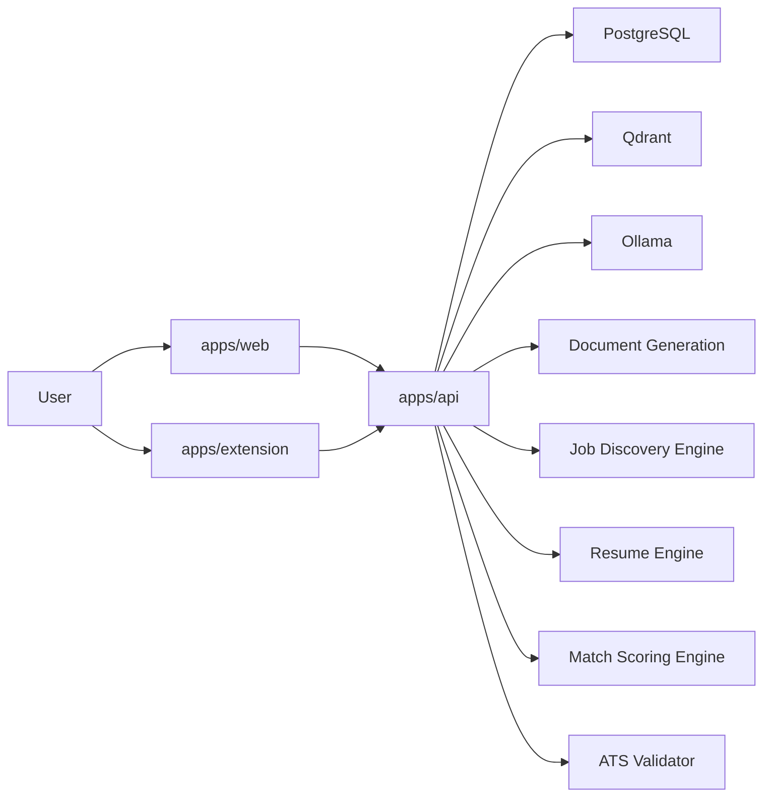

# CareerOS AI Architecture

## High-Level System View

CareerOS AI uses a local-first monorepo with three user-facing surfaces:

- Web dashboard for orchestration and review
- FastAPI backend for domain logic and persistence
- Browser extension for page extraction and autofill

Core platform services:

- PostgreSQL for relational data
- Qdrant for semantic retrieval
- Ollama for local AI inference



## Repository Layout

```text
autoapply-agent/
  apps/
    web/
    api/
    extension/
  packages/
    shared/
    resume-engine/
    job-engine/
    ats-engine/
    ai-engine/
    autofill-engine/
  infra/
  docs/
```

## Service Responsibilities

### apps/web

- Dashboard and workflow UI
- Profile switching
- Review and approval screens
- Application pipeline visibility

### apps/api

- Authentication and profile-aware API surface
- Business logic orchestration
- Database access
- AI model coordination
- File upload and export endpoints
- Maintenance endpoints for audit logs, encrypted backups, and data deletion

### apps/extension

- In-page job extraction
- Autofill preparation
- Safe field mapping
- Stop-before-submit behavior

### packages/shared

- Shared schemas, types, constants, and validation helpers

### packages/resume-engine

- Resume ingestion
- Section parsing
- Evidence mapping
- Tailoring orchestration

### packages/job-engine

- Job discovery connectors
- Deduplication
- Source normalization

### packages/ats-engine

- ATS structure validation
- Readability and compatibility checks

### packages/ai-engine

- Ollama client wrapper
- JSON response helper
- Timeout and retry policies

### packages/autofill-engine

- Page field mapping
- Safe autofill logic
- Review gating for sensitive fields

## Domain Workflow

### Resume path

1. Upload resume
2. Extract text
3. Parse sections
4. Split claims into evidence-backed units
5. Store structured JSON
6. Embed content in Qdrant

### Job path

1. Discover or extract job
2. Normalize job record
3. Analyze requirements
4. Score against profile
5. Decide whether to tailor

### Application path

1. Generate tailored resume
2. Run ATS validation
3. Export documents
4. Prepare application packet
5. Autofill fields in extension
6. Stop before submission
7. Require human approval

## Agent Architecture

The system uses an orchestrated agent loop rather than an unconstrained autonomous agent.

Agent stages:

1. Discover jobs
2. Parse job requirements
3. Score jobs
4. Tailor resume if eligible
5. Prepare application
6. Route sensitive answers to review
7. Await approval
8. Log every action

Important guardrails:

- No stage may cross profile boundaries
- No stage may invent source facts
- No stage may submit without approval
- No stage may bypass website protections

## Multi-Profile Data Model

User-owned data must be partitioned by `profile_id` where relevant.

Profile-scoped entities include:

- profile settings
- master resumes
- resume evidence
- jobs discovered for that profile
- job matches
- resume versions
- applications
- application answers
- answer bank
- agent runs
- audit logs

## Database Model Overview

### users

- Top-level account identity

### profiles

- Separate career contexts owned by a user

### profile_settings

- Target roles, locations, thresholds, and automation preferences

### master_resumes

- Source resume artifact and parsed structured JSON

### resume_sections

- Normalized sections such as summary, skills, and experience

### resume_evidence

- Traceability records linking claims to source passages

### jobs

- Normalized job records from discovery or browser extraction

### job_requirements

- Parsed requirements and signals from AI or rule-based analysis

### job_matches

- Scoring outcomes and hard reject reasons

### resume_versions

- Generated tailored variants per job

### applications

- Application state, status, source, and approval tracking

### application_answers

- Saved application responses with review flags

### answer_bank

- Profile-scoped canonical answers for safe autofill

### agent_runs

- Run history, stage progression, and failures

### audit_logs

- Immutable activity trail

## Extension Architecture

The browser extension has three responsibilities:

- Detect supported job page patterns
- Extract job details from visible page content
- Autofill application forms from trusted profile data

Safety design:

- Do not scrape hidden content or protected flows
- Do not attempt bypasses
- Do not submit forms automatically
- Require user review for uncertain or sensitive fields

## AI Architecture

Model roles:

- Qwen3: job parsing and structured extraction
- DeepSeek-R1: resume tailoring and reasoning
- BGE-M3: embeddings and semantic matching

AI output handling:

- Strict schema validation
- Retry once on invalid JSON
- Timeout and availability checks
- Clear error reporting to the UI

## Security Architecture

- Local-first deployment minimizes external data exposure
- Profile isolation prevents cross-profile leakage
- Sensitive answers come from explicit answer bank entries
- Audit logs record important actions
- File uploads require size and type validation
- Generated documents should avoid leaking hidden metadata
- Backup exports are encrypted before leaving the API boundary
- Data deletion preserves audit history for incident review

## Deployment Architecture

Local development targets:

- Next.js web app
- FastAPI backend
- Plasmo extension
- PostgreSQL and Qdrant via Docker Compose
- Ollama running locally on the host or via dedicated service

## Key Design Constraints

- Truthfulness over completeness
- Human approval over automation
- Simplicity over opaque agent behavior
- Strong typing and validation over permissive ingestion
- Test coverage over speculative functionality
